# Total Market Share
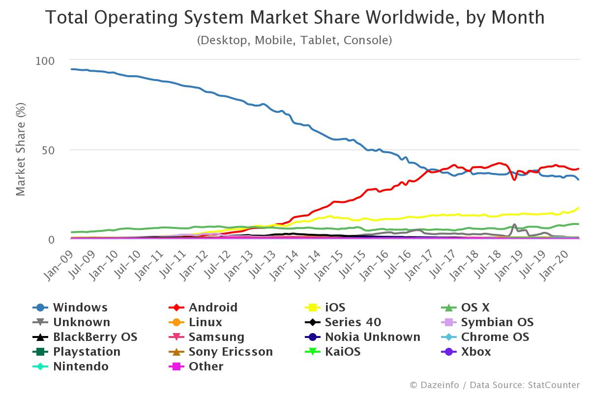{ width=80% }\

# Mobile Market Share
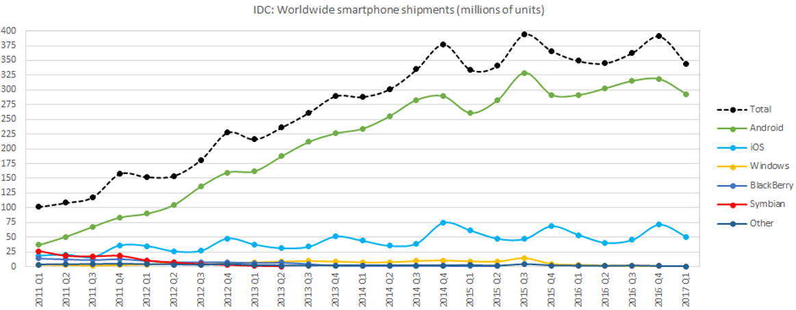

# Genealogia famiglia Unix
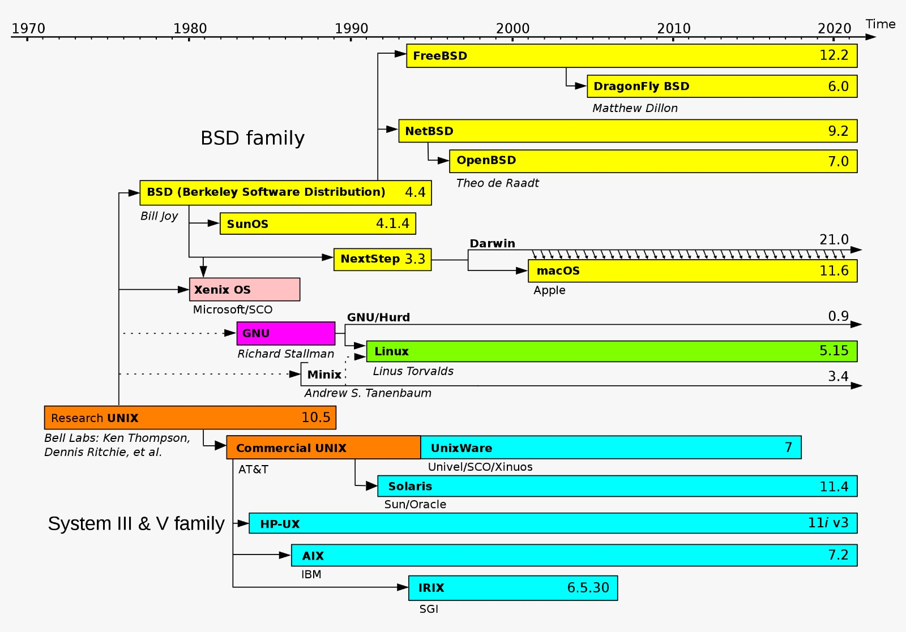{ width=80% }\

# Architettura interna
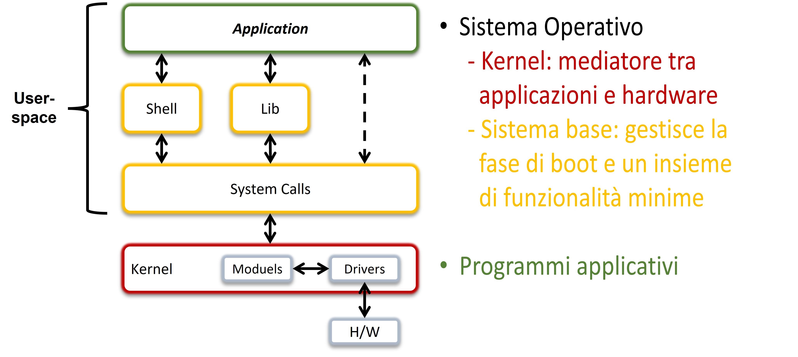{ width=100% }\

# Struttura a guscio
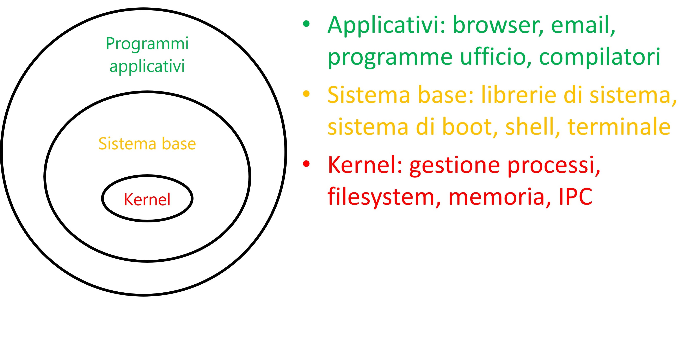

# Interazione Kernel-Applicazioni
* Applicazioni richiedono servizi al kernel (system calls)
* Kernel elabora la risposta e risponde all'applicazione
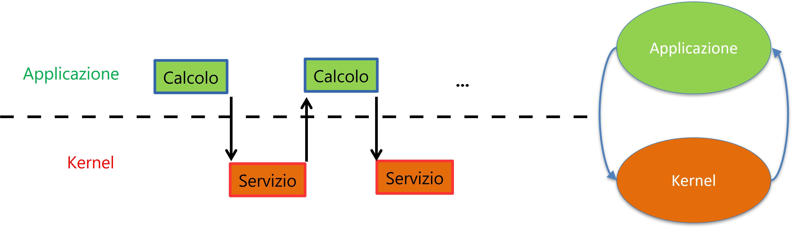

# Funzionalità principali OS
{ width=100% }\

# Monolitici, Micro, Ibridi
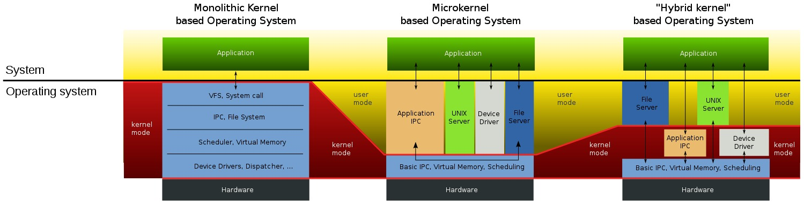

# Quanto è complesso un kernel
* 20K SLOC (XV6), https://github.com/mit-pdos/xv6-public
* 30M SLOC (Linux Kernel 5), https://www.kernel.org/

{ width=25% }\

# Linux kernel map
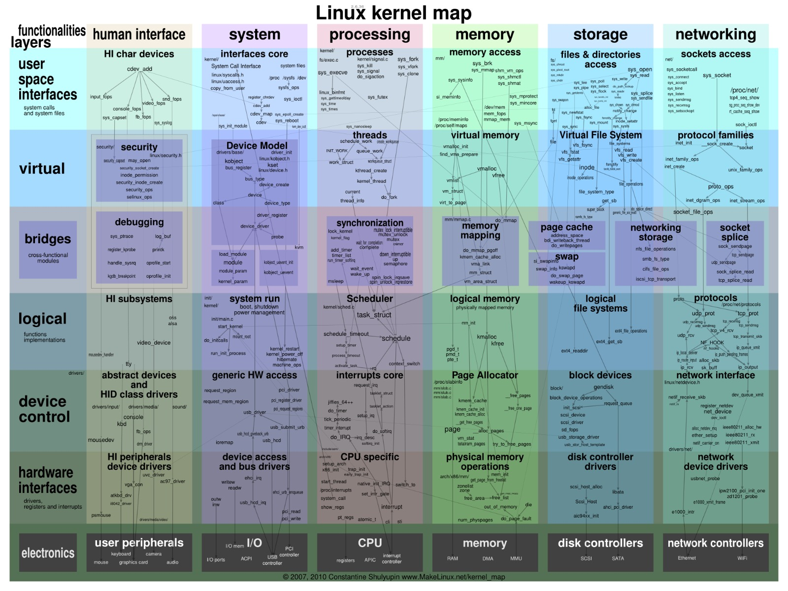{ width=70% }\

# Filosofia UNIX
...

# KISS principle
* **Keep It Simple, Stupid**
* In riferimento al codice sorgente di un programma, **significa mantenere uno stile di progettazione semplice e lineare** demandando le ottimizzazioni al compilatore o a successive fasi dello sviluppo.
* **In ambito UNIX, tanti semplici strumenti in grado di funzionare in modo orchestrato piuttosto che una sola struttura monolitica**
* Richiama in parte il principio filosofico del Rasoio di Occam: a parità di fattori la soluzione più semplice è da preferire.
* (https://en.wikipedia.org/Wiki/Unix-philosophy)

# Multitasking
* **Un sistema operativo multitasking permette di eseguire più programmi (task) contemporaneamente**. Ad esempio, se viene chiesto al sistema di eseguire due processi, A e B, la CPU eseguirà per qualche istante il processo A, poi per qualche istante il processo B, poi tornerà ad eseguire A e così via.
* Il componente del Kernel delegato a questa funzione viene chiamato **scheduler**.
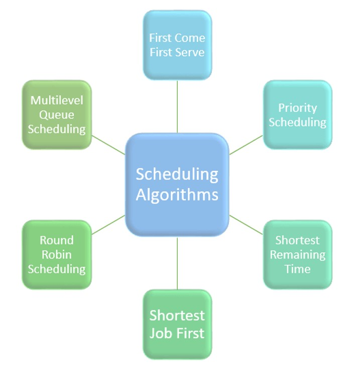{ width=35% }\

# Multiutenza
* **Un sistema multiutente può essere utilizzato contemporaneamente da utenti diversi.** Ad ogni utente del sistema viene assegnato uno username, una password, e una cartella personale.
-/Users/numeutente (macOS)  
-/home/nomeutente (Linux)

# Console e terminali
...

# Terminale testuale
* **Con il termine console o terminale si definisce una coppia tastiera/video collegata alla macchina.**
* Storicamente, per rendere accessibile una macchina da più utenti, era possibile collegare più tastiere e video allo stesso computer.
* Oggi i terminali sono virtuali.

# Terminale testuale
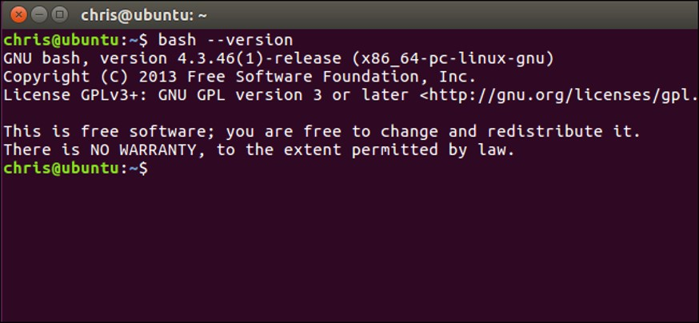

# Terminale grafico
* Esistono terminali più evoluti, i cosiddetti terminali grafici che permettono di utilizzare un'interfaccia grafica (GUI) per eseguire le operazioni di input/output.
* Windows dispone di un solo terminale grafico, i sistemi Unix ne hanno diversi intercambiabili (X Window System),
* https://www.tecmint.com/best-linux-desktop-enviroments/

# Terminale grafico
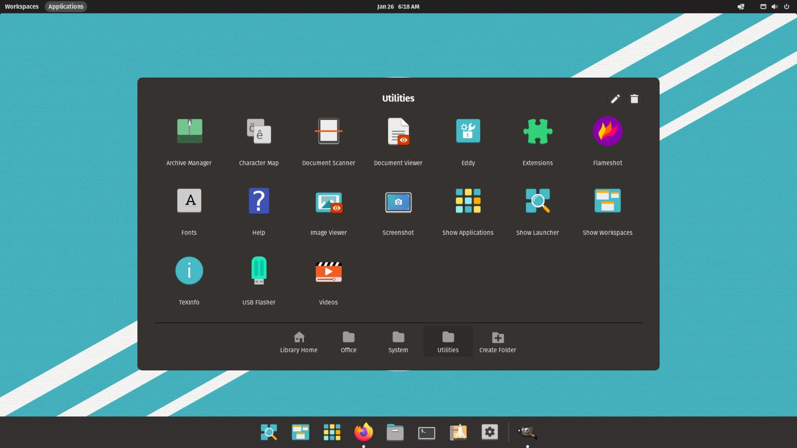{ width=95% }\

# Perchè usare il terminale testuale?
* Accesso completo alla configurazione del sistema e dei servizi
* Automatizzazione e scripting
* Basso consumo di risorse computazionali
* Esistono applicazioni in cui un terminale grafico non viene installato perchè inutile (non esiste monitor) o per risparmiare risorse (apparati rete/applicazioni IoT)

# Apertura e chiusura sessioni
...

# login
* Password: ******
* Last login: Fri Mar 06 10:27:08 on tty2

**$ <- shell prompt**

# shell
* **Programma che permette di far interagire l'utente con il sistema operativo tramite comandi**

*resta in attesa di un comando...*

*esegue il comando alla pressione di "ENTER"*

* **La shell é un interprete di comandi**

*interpreta ed esegue comandi inseriti da tastiera o da file*

*linguaggio di scripting*

# Ciclo di esecuzione shell
```
loop forever
	<LOGIN>
	do
		<ricevi comando da file in input>
		<interpreta comando>
		<esegui comando>
	while (!<EOF>)
	<LOGOUT>
end loop
```
# Quale shell?
* **La shell non é unica, un sistema può metterne a disposizione varie**  
 *Bourne shell (/bin/bash)*  
 *C shell (/bin/csh)*  
 *Fish shell (bin/fish)*  
* **Ogni utente può indicare la shell preferita. La scelta viene memorizzata in /etc/passwd**(file di sistema contenente le informazioni degli utenti)
* Dopo il login, per ogni utente viene generato un processo shell dedicato

# passwd
Per modificare la password dell'utente in esecuzione è possibile utilizzare il comando:  
**passwd [OPTION] [USER]**  

$ passwd  
(current) UNIX password:  
Enter new UNIX password:  
Retype new UNIX password:  

# logout
* Per uscire da una shell si può utilizzare il comando **exit** (che invoca la system call exit() per quel processo). In alternativa:  
**exit**  
**CTRL+D**  
Per rientrare, va effettuato un nuovo login

# shutdown
* Varie possibilità  
$ **sudo** shutdown --halt now  
$ **sudo** shutdown --reboot now  
$ **sudo** halt  
$ **sudo** reboot  

* Trattandosi di modifica al sistema (lo spegnimento coinvolge tutti gli utenti) sono necessari i diritti di amministrazione  

 **sudo** cmd (esecuzione di un singolo comando)  
 **sudo** -i (shell interattiva)  

# Manuale in linea
...

# man
* **Esiste un manuale on-line (man)**, consultabile per informazioni su ogni comando Linux. Indica:  
formato del comando (input) e risultato atteso (output)  
descrizione delle opzioni  
possibili restrizioni  
file di sistema interessati dal comando  
comandi correlati  
eventuali bug per uscire dal manuale  
* Per uscire premere **q**

# apropos
* **Per cercare una pagina di manuale** di cui non si conosce il nome, è possibile usare il comando **apropos** per cercare tutte le pagine che contengono una keyword specifica  

**$ apropos man**  
**$ apropos top**  

# Utenti e gruppi
...

# Concetto di gruppo
* **Sistema multiutente --> problemi di privacy e di possibili interferenze: necessità di proteggere/nascondere informazioni**
* Concetto di gruppo (staff, utenti, studenti): possibilità di lavorare sugli stessi documenti
* Ogni utente appartiene a un gruppo principale ma può far parte anche di gruppi secondari a seconda delle esigenze e configurazioni

# Utenti
* **Ogni utente è definito univocamente all'interno del sistema mediante uno username.** Gli utenti del sistema sono distribuiti in più   gruppi; ogni utente fa parte di almeno un gruppo.
* Esiste un utente privilegiato, il cui username è **root**, che viene assegnato all'amministratore del sistema. **root** *può modificare la configurazione dell'intero sistema.*

# sudo
$ **sudo** apt-get update  
$ <-- Prompt utente normale  
Eleva i diritti di esecuzione (da utente a root) per un solo comando.  
Per aggiornare il sistema sono neccessari diritti di amministrazione.  
$ **sudo-i**  
\# <-- Prompt utente root  
Eleva i diritti di esecuzione in modo permanente.

# /etc/passwd
**Username**: username dell'utente  
**Password**: la x indica che la password cifrata è presente nel file /etc/shadow  
**User ID (UID)**: ID utente  
**Group ID (GID)**: ID del gruppo (primario) dell'utente  
**User ID Info**: Informazioni aggiuntive  
**Home directory**: percorso assoluto home directory utente  
**Command/shell**: percorso assoluto shell utente  
*nicola:x:10000:1000:Nicola B.:/home/nicola:/bin/bash*

# /etc/group
**Group name**: nome del gruppo  
**Password**: generalmente non utilizzato. Si possono definire password di gruppo  
**Group ID (GID)**: ID del gruppo  
**Group List**: lista degli utenti che appartengono al gruppo  
*adm:x:4:syslog,nicola*  
*sudo:x:27:nicola*  
*nicola:x:1000:*  

# whoami, id
who-am-I mostra il nome dell'utente corrente  
$ **whoami**  
*nicola*  
id mostra UID, GID, gruppi secondari  
$ **id**  
*uid=1000(nicola), gid=1000(nicola), groups=1000(nicola), 4(adm), 24(cdrom), 27(sudo), 30(dip), 46(plugdev), 116(lpadmin), 126(sambashare)*  

# Protezione dei file
* Multiutenza implica necessità di regolare gli accessi alle informazioni. Per ogni file, esistono 3 tipi di utilizzatori:  
**proprietario, user**  
**gruppo del proprietario, group**  
**tutti gli altri utenti, others**  
* Per ogni utilizzatore, si distinguono tre modi di accesso al file:  
**lettura(r)**  
**scrittura(w)**  
**esecuzione(x) (per una directory significa list del contenuto)**  
* Ogni file è marcato con UID e GID del proprietario  
* 12 bit di protezione  

# File e metadati
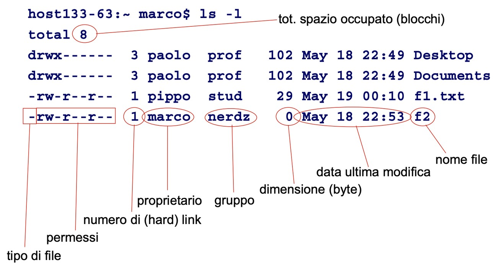{ width=95% }\

# Bit di protezione
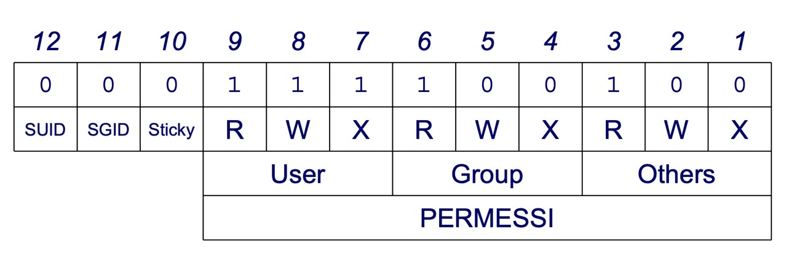

# chmod, chown
**chmod [opzioni] mode file**  
Assegna diritti ad un file  
$ chmod 0755/home/nicola/test  
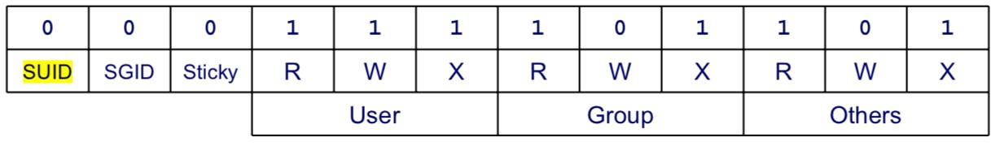  
**chown [opzioni] owner: group file**  
Assegna proprietario e gruppo ad un file  
$ chown nicola:nicola/home/nicola/test  

# SUID, SGID, Sticky
* SUID (Set User ID)  
Si applica a un file di programma eseguibile solamente  
**Se attivo, l'utente che esegue il programma viene considerato il proprietario di quel file (solo per la durata dell'esecuzione)**  
È necessario per consentire la lettura/scrittura su file di sistema, che l'utente non avrebbe il diritto di leggere/modificare.  
Esempio: passwd(vedi diritti /etc/passwd)  
* SGID: come SUID bit, ma per il gruppo  
* Sticky: il sistema cerca di mantenere in memoria l'immagine del programma, anche se non è in esecuzione  

# adduser, deluser
* $ **sudo** adduser utente  
Aggiunge un nuovo utente al sistema  
* $ **sudo** deluser utente  
Rimuove un utente dal sistema  
**In alternativa, è sempre possibile modificare manualmente i file /etc/passwd e /etc/group e usare il commando passwd per aggiornare la password**

# Processi
...

# Utenti e Processi
* **Ogni operazione eseguita su una macchina Unix viene effettuata a nome e per conto di un determinato utente.** Non esistono task o programmi funzionanti in modalità anonima!
* Ogni programma viene eseguito per conto di un determinato utente e pertanto ne aquisisce tutti i permessi ed i vincoli.  
**$ ps aux**  

# Avvio del sistema
{ width=80% }\

# Flussi dati standard
* I comandi UNIX si comportano come FILTRI
* UN filtro è un programma che riceve un ingresso da input e produce il risultato su uno o più output
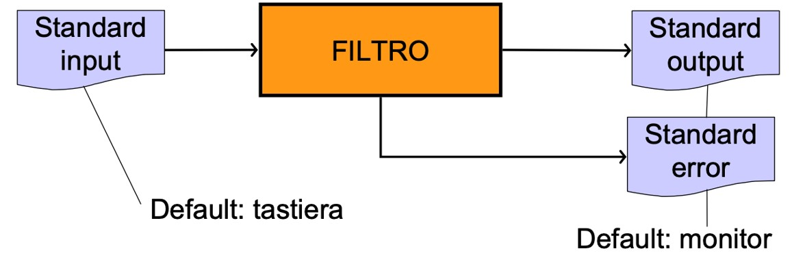

# Esecuzione comando (processo)
* $ ls
* **I comandi principali del sistema si trovano nelle directory /bin oppure /usr/bin**
* Possibilità di realizzare nuovi comandi (scripting). Per ogni comando, la shell genera un processo figlio dedicato alla sua esecuzione
* Il processo padre attende la terminazione del comando (foreground) o prosegue in parallelo (background)

# Formato invocazione
* **nome comando** *opzioni* argomenti
* $ **ls** *-l* filename
* Convenzione nella rappresentazione della sintassi comandi:  
 se un'opzione o un argomento possono essere omessi, si indicano tra quadre [opzione]  
 se due opzioni/argomenti sono mutuamente esclusivi, vengono separati da |. Ad esempio: arg1 | arg2  
 quando un argomento può essere ripetuto n volte, si aggiungono dei puntini argomento...

# ps
** Un processo utente in genere viene attivato a partire da un comando (da cui prende il nome).** Tramite ps si può vedere (staticamente) la lista dei processi attivi. Per una rappresentazione continua si utilizza top.  
*nicola@ubuntu:~$ ps*  
  PID&nbsp;&nbsp;&nbsp;&nbsp;TTY&nbsp;&nbsp;&nbsp;&nbsp;&nbsp;&nbsp;&nbsp;&nbsp;&nbsp;&nbsp;&nbsp;&nbsp;&nbsp;&nbsp;TIME&nbsp;CMD  
 5527 pts/0&nbsp;&nbsp;&nbsp;00:00:00&nbsp;&nbsp;bash  
 7595 pts/0&nbsp;&nbsp;&nbsp;00:00:00&nbsp;&nbsp;ps  

# top - linea #1
* Ora attuale (21:34:21)
* Uptime della macchina (3:51)
* Utenti attualmente connessi (2 users)
* Media del carico di sistema. I 3 valori si riferiscono a: ultimo minuto, ultimi 5 minuti, ultimi 15 minuti.
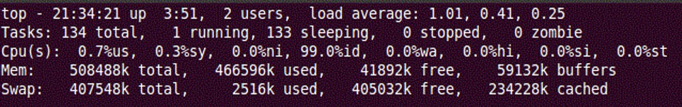

# top - linea #2
* Processi totali in esecuzione (134 total)
* Processi attivi (1 runnning)
* Processi dormienti (133 slepping)
* Processi in stop (0 stopped)
* Processi che aspettano di essere gestiti dal processo padre (0 zombie)


# top - linea #3
* Percentuale del carico dei processi utente (0.7%**us**)
* Percentuale del carico dei processi di sistema (0.3%**sy**)
* Percentuale del carico dei processi con priorità di aggiornamento *nice* (0.0%**ni**)
* Percentuale di inattività della cpu (99.0%**id**)
* Percentuale dei processi in attesa di operazioni I/O (0.0%**wa**)


# Filesystem
...

# Tutto è **file**
* File come risorsa logica costituita da sequenza di bit, a cui viene dato un nome
* **Astrazione che consente di trattare allo stesso modo entità fisicamente diverse** come file di testo, dischi rigidi, stampanti, direttori, tastiera, video, ...  
 Ordinari: archivi di dati, comandi, programmi sorgente  
 Directory: contengono riferimenti a file  
 Speciali: dispositivi hardware, FIFO, soft links  

# Tutto è **file**
* È possibile nominare un file con una qualsiasi sequenza di caratteri (max 255), a eccezione di '.' e '..'
* È sconsigliabile utilizzare per il nome di file dei caratteri speciali, ad es. metacaratteri e segni di punteggiatura
* Ad ogni file possono essere associati uno o più nomi simbolici (link) ma ad ogni file è associato un solo **i-node**

# File di testo, file binario
* **Tipo di file**: lo specifico tipo di informazione contenuta all'interno di file **ordinari** (audio, immagini, testo)  
 **File di testo**: leggibile da un essere umano. I dati contenuti rappresentano caratteri (ASCII o Unicode)  
 **File binario**: richiede specifica interpretazione di un software per essere letto (mp3, jpg, mp4)  
* **Estensione**: i caratteri terminali del nome di un file (di solito 3) che alcuni sistemi, ad esempio Windows ne rappresentano il tipo 

# Struttura file system
* Ogni cartella di / rappresenta un gruppo di file con uno scopo preciso
* Varia fra i sistemi. In generale:  
 **/bin** binari essenziali (sistema di base)  
 **/etc** file di configurazione  
 **/home** home degli utenti  
 **/proc** interfaccia verso il kernel  
 **/tmp** file temporanei  
 **/usr** binari non essenziali  
 **/var** log di sistema  

# Struttura file system
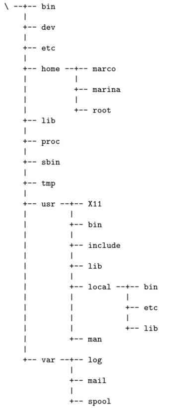{ width=25% }\

# Struttura file system
* All'atto del login, l'utente comincia ad operare all'interno di una specifica directory (/home/nomeutente)
* In seguito è possibile cambiare directory
* Il sistema operativo mette a disposizione comandi per orientarsi e navigare all'interno del filesystem (cd, pwd)  
{ width=15% }\

# Nomi assoluti e relativi
* Ogni utente può specificare unn file attraverso:  
 **nome relativo**: è riferito alla posizione dell'utente nel file system (direttorio corrente)  
 **nome assoluto**: è riferito alla radice della gerarchia. Inizia SEMPRE con /  
* Nomi particolari:  
 **.** direttorio corrente (visualizzato da pwd)  
 **..** direttorio 'padre'  
 **~** home utente  

# Nomi assoluti e relativi
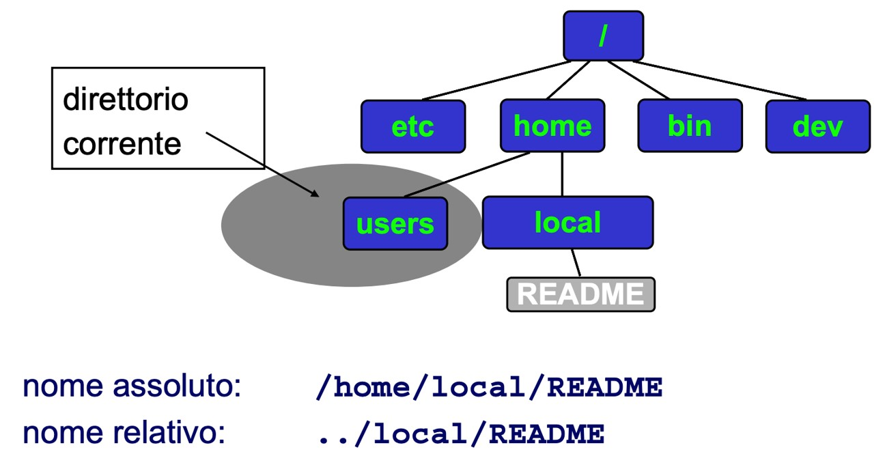

# i-node
```
// XV6 OS, file.h
// https://github.com/mit-pdos/xv6-public

struct inode {
	uint dev; // Device number
	uint inum; // Inode number
	int ref; // Reference count
	int flags; // I*BUSY, I*VALID
	
	short type;
	short major;
	short minor;
	short link;
	uint size;
	uint addrs[NDIRECT+1];
};
```
# i-node
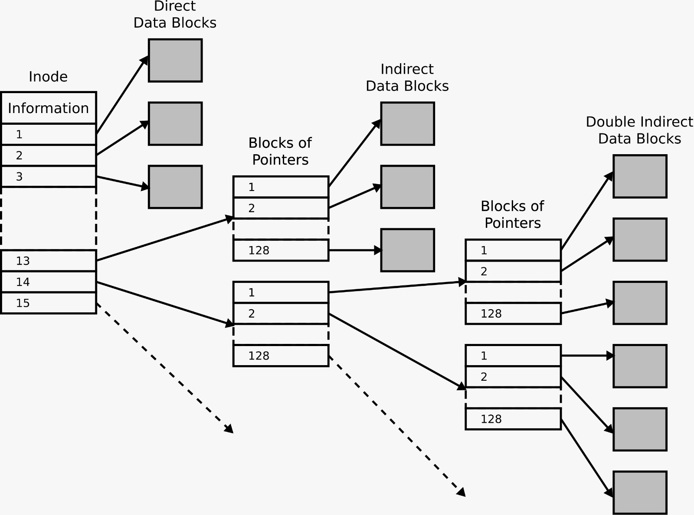{ width=72% }\

# Links
* **Le informazioni contenute in un file possono essere visibili attraverso nomi diversi, tramite "riferimenti" (link) allo stesso file fisico**
* Il sistema operativo considera e gestisce la molteplicità possibile di riferimenti: se un file viene cancellato, le informazioni sono veramente eliminate solo se non ci sono altri link a esso
* Due tipi di link:  
 link fisici (*$ ln src dst*)  
 link simbolici (*$ ln -s src dst*)  

# cp vs ln vs ln -s
$ cp /home/nicola/f1/home/nicola/f2
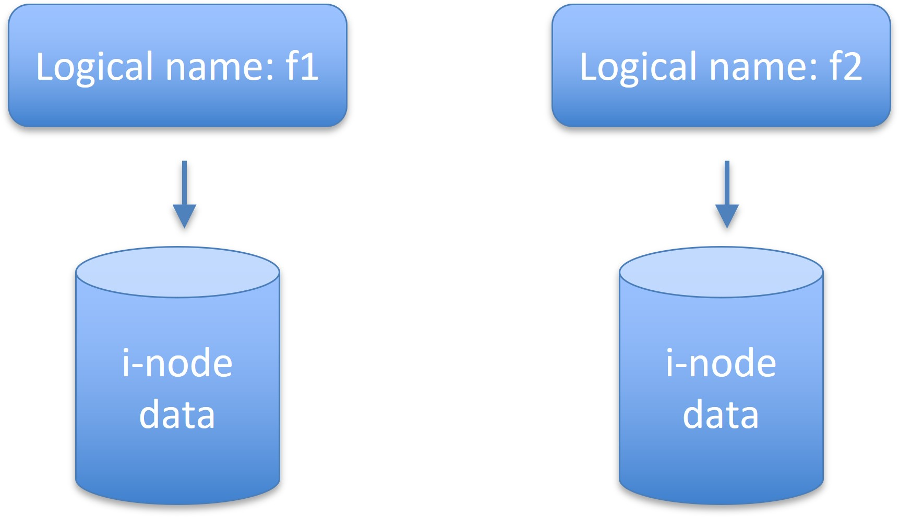{ width=70% }\

# cp vs ln vs ln -s
$ ln /home/nicola/f1/home/nicola/f2
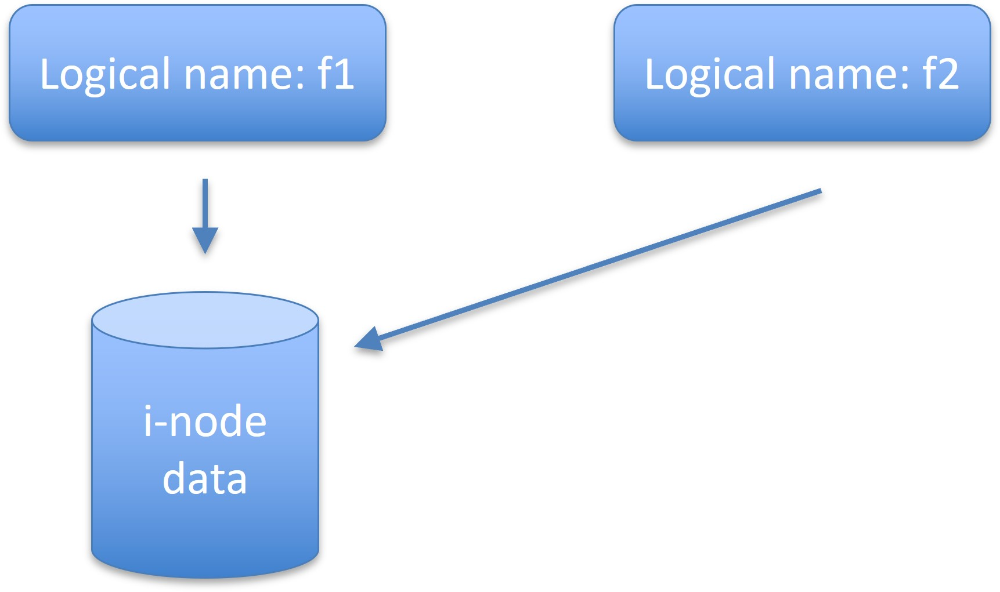{ width=70% }\

# cp vs ln vs ln -s
$ ln -s /home/nicola/f1/home/nicola/f2
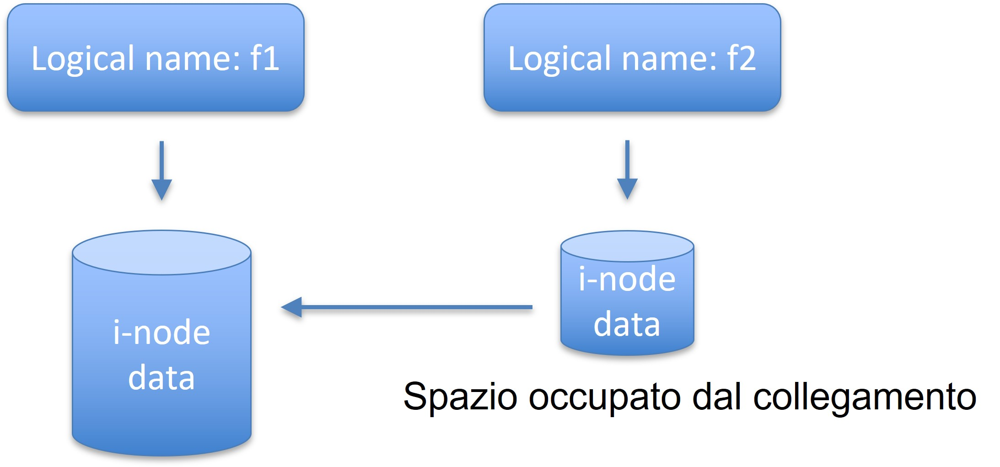{ width=70% }\

# stat
* **Fornisce una configurazione dettagliata dello stato di un file. Il formato di output è configurabile.**  
*$ stat /etc/passwd*  
**File**: */etc/passwd*  
**Size**: *2462* **Blocks**: *8* **IO Block**: *4096* **regular file**  
**Device**: *801h/2049d* **Inode**: *132607* **Links**: *1*  
**Access**: *(0644/-rw-r--r--)* **Uid**: *( 0/ root)* **Gid**: *( 0/ root)*  
**Access**: *2020-04-03 08:17:01.642000837 -0700*  
**Modify**: *2020-03-09 06:49:17.914593212 -0700*  
**Change**: *2020-03-09 06:49:17.918592969 -0700*  
**Birth**: *-*  

# Composizione pacchetti
...

# mount
* **Un file system (contenuto su qualsiasi dispositivo) per essere utilizzato deve essere montato su un file system esistente**, usando una directory come punto di attacco.  
 Ad esempio, per le chiavette usb  
* La directory di aggancio prende il nome di mount point

# umount
* Il file system può essere staccato dal suo mount point tramite l'operazione di umount (inversa di mount).
* Per motivi di efficienza, le scritture su di un file system sono eseguite in blocco, al momento più favorevole
* **Estrarre fisicamente un dispositivo senza aver smontato il suo file system può portare corruzione dei dati!**

# Esempio mount
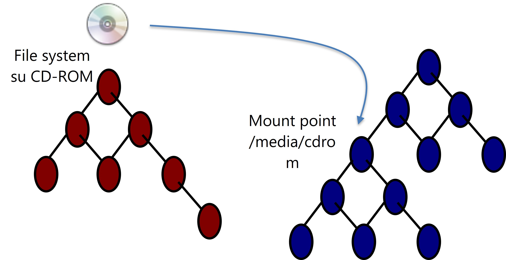{ width=95% }\

# Installazione pacchetti
...

# apt
* **apt** è il comando per la gestione (update/search/show/install/remove) di pacchetti in distribuzioni derivate da Debian
* **/etc/apt/sources.list** contiene la lista dei repository attivi
* **L'installazione o la rimozione di software di sistema richiede diritti di amministrazione (sudo)**

# apt
* **apt update** aggiorna la lista dei pacchetti disponibili
* **apt search pkgname** cerca pacchetti in base a parole chiave
* **apt show pkgname** mostra i dettagli di un pacchetto
* **apt install pkgname** installa un pacchetto e le sue dipendenze
* **apt remove pkgname** rimuove un pacchetto
* **apt autoremove** rimuove pacchetti inutili (dipendenze di pacchetti già rimossi in precedenza)
* **apt clean** rimuove tutti i pacchetti scaricati

# apt
 $ sudo apt update  
 $ sudo apt search mc  
 $ sudo apt install mc  
 $ mc  
 ...  
 $ sudo apt remove mc  
 $ sudo apt autoremoe  
 $ sudo apt clean  
