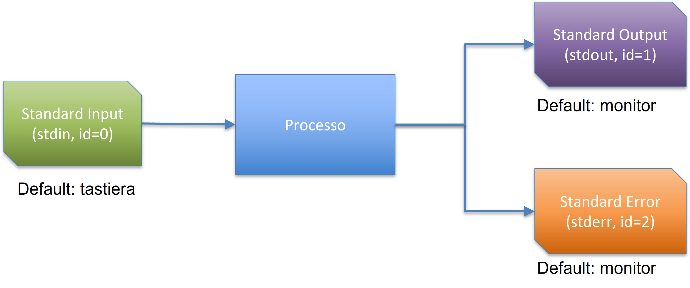
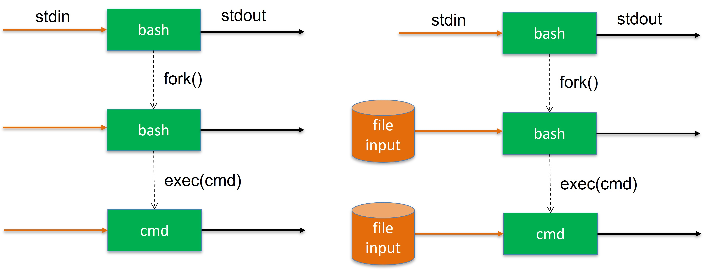
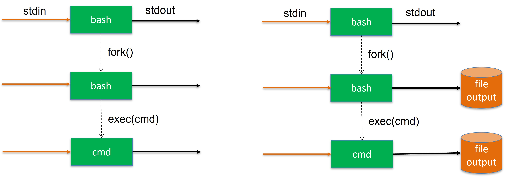
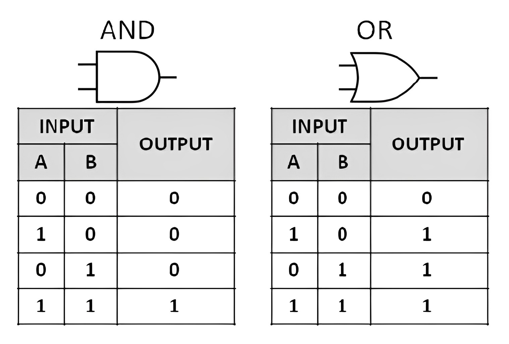
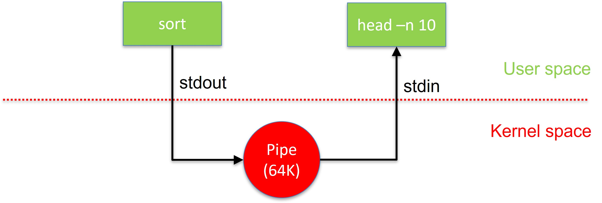
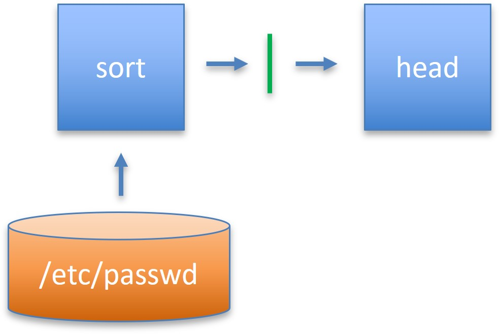
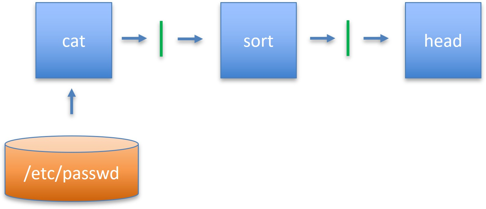

# Utilità

# Builtins
* Bash, come **interprete dei comandi**, carica in memoria il contenuto di file binari presenti nel filesystem (es. /bin/ls), e li rende disponibili per l'esecuzione attraverso la metafora di *processo*

```
$ ls  
$ which ls  
/bin/ls  
$ which which  
/usr/bin/which  
```

# Builtins
* Esistono particolari comandi, detti **builtins**, che non provengono dall'esecuzione di un file binario ma sono **implementati all'interno della shell**. Nel loro caso, *$ which comando* non ritorna un percorso perchè il file binario non esiste! Ad esempio:

  $ cd  
  $ alias  
  $ history  
  $ logout  

https://www.gnu.org/software/bash/manual/html_node/Bash-Builtins.html


# alias
**$ alias ll='ls -l'**  
**$ ll**  
drwxr-xr-x+ &nbsp; &nbsp; 51 &nbsp; nicola &nbsp; &nbsp; staff &nbsp; &nbsp; 1632 &nbsp; Mar &nbsp; 14 &nbsp; 11:09 &nbsp; .    
drwxr-xr-x &nbsp; &nbsp; &nbsp; &nbsp; 6 &nbsp; &nbsp; &nbsp; root &nbsp; admin &nbsp; &nbsp; 192 &nbsp; Nov &nbsp; 14 &nbsp; 2018 &nbsp; &nbsp; ..  
drwx\-\-\-\-\-\-@ &nbsp; &nbsp; &nbsp; 6 &nbsp; nicola &nbsp; &nbsp; staff &nbsp; &nbsp; &nbsp; 192 &nbsp; Feb &nbsp; 24 &nbsp; 16:09 &nbsp; Applications  
drwx\-\-\-\-\-\-+ &nbsp; &nbsp; &nbsp; &nbsp; 6 &nbsp; nicola &nbsp; &nbsp; staff &nbsp; &nbsp; &nbsp; 192 &nbsp; Mar &nbsp; 19 &nbsp; 00:10 &nbsp; Desktop  
drwx\-\-\-\-\-\-+ &nbsp; &nbsp; &nbsp; &nbsp; 7 &nbsp; nicola &nbsp; &nbsp; staff &nbsp; &nbsp; &nbsp; 224 &nbsp; Feb &nbsp; 29 &nbsp; 12:15 &nbsp; Documents  
drwxr-xr-x+  &nbsp; &nbsp; 28 &nbsp; nicola &nbsp; &nbsp; staff &nbsp; &nbsp; &nbsp; 896 &nbsp; Mar &nbsp; 18 &nbsp; 18:55 &nbsp; Downloads  
drwx\-\-\-\-\-\-@ &nbsp; &nbsp; &nbsp; 9 &nbsp; nicola &nbsp; &nbsp; staff &nbsp; &nbsp; &nbsp; 288 &nbsp; Mar &nbsp; 11 &nbsp; 13:16 &nbsp; Dropbox  
drwx\-\-\-\-\-\-@ &nbsp; &nbsp; 10 &nbsp; nicola &nbsp; &nbsp; staff &nbsp; &nbsp; &nbsp; 320 &nbsp; Mar &nbsp; 14 &nbsp; 11:10 &nbsp; Google Drive  
drwx\-\-\-\-\-\-@ &nbsp; &nbsp; 75 &nbsp; nicola &nbsp; &nbsp; staff &nbsp; &nbsp; 2400 &nbsp; Mar &nbsp; &nbsp; 3 &nbsp; 19:07 &nbsp; Library  
drwx\-\-\-\-\-\-+ &nbsp; &nbsp; &nbsp; &nbsp; 3 &nbsp; nicola &nbsp; &nbsp; staff &nbsp; &nbsp; &nbsp; &nbsp; 96 &nbsp; &nbsp; Jul &nbsp; &nbsp; 6 &nbsp; &nbsp; 2018 &nbsp; Movies  
**$ unalias ll**


# history 
**$ history**  
1 uname -a  
2 clear  
3 exit   
4 ls  


$ **!!**     (esegue ultimo comando)  
$ **!2**     (esegue comando #2)  


# Freccia su-giù, ctrl-r, tab
* **Tasti freccia (su e giù)** consentono di spostarsi all'interno della lista dei comandi precedenti (lo stesso elenco mostrato dal comando history)

* **ctrl-r** consente di inserire una stringa e selezionare tutti i comandi precedenti che la contengono. Ogni pressione successiva della combinazione **ctrl-r** accede agli altri comandi della stessa selezione

* **tab** auto-completa i nomi di file. Una doppia pressione (rapida) mostra l'elenco di tutte le possibilità disponibili


# Ridirezione flussi dati 


# Flussi dati


# Filtri Unix
* **cat** [opzione]...[file]...
  - Legge da file o stdin, scrive su stdout
* **grep** [opzione]... testo [file]...
  - Legge da file o stdin, scrive su stdout le linee che contengono <testo>
* **head** [opzione]...[file]...
  - Legge da file o stdin, scrive su stdout un subset delle righe (prime n)
* **tail** [opzione]...[file]...
  - Legge da file o stdin, scrive su stdout un subset delle righe (ultime n)
* **cut** [opzione]...[file]...
  - Legge da file o stdin, scrive su stdout un subset delle colonne del file
* **sort** [opzione]...[file]...
  - Legge da file o stdin, scrive su stdout linee ordinate
* **tee** [opzione]...[file]...
  - Legge da stdin, sdoppia il flusso in ingresso su stdout e <file>  


# Ridirezione
* E' possibile ridirigere input e/o output di un comando facendo sì che stdin/stdout/stderr siano sostituiti da file **in modo trasparente al comando**
* Ridirezione dell'input  
  -comando < filein  
* Ridirezione dell'output  
  -comando > fileout   (sovrascrive fileout)  
  -comando >> fileout (aggiunge alla fine di fileout)  
  
# Esempi ridirezione
**$ cat /etc/passwd**  
cat legge da /etc/passwd e stampa il contenuto su stdout  
**$ cat < /etc/passwd**  
cat legge da stdin, ma il flusso proviene da /etc/passwd  
**$ sort < fin > fout**  
sort legge da stdin, ma il flusso proviene da fin  
sort scrive su stdout, ma il flusso è ridiretto su fout  
**$ head fin > fout**  
head legge da fin  
head scrive su stdout, ma il flusso è ridiretto su fout  


# Esempi ridirezione
**$ tr [:lower:] [:upper:] < fin > fout**

tr legge da stdin, ma il flusso proviene da fin

tr scrive su stdout, ma il flusso è ridiretto su fout


**$ who >> users**

who scrive su stdout, ma il flusso è ridiretto su users (append)


# Implementazione ridirezione input



# Implementazione ridirezione output



# Separazione stdout, stderr
**$ grep nicola /etc/passwd**
* Seleziona tutte le righe che contengono la stringa *nicola* all'interno del file /etc/passwd e le stampa sul terminale
  - Se il file viene trovato, stampa il risultato su stdout
  - Se il file non viene trovato, stampa un errore su stderr
* **E' possibile separare stdout e stderr menzionandoli in modo esplicito in forma numerica (0=stdin, 1=stdout, 2=stderr**


$ grep nicola /etc/passwd **1>/dev/null**  
(scarta stdout, mostra stderr)


$ grep nicola /etc/passwd **2>/dev/null**  
(scarta stderr, mostra stdout)


# Separazione stdout, stderr

**$ vim test.py**
```shell
#!/usr/bin/env python3
import sys  
sys.stdout.write("Hello stdout!\n")
sys.stderr.write("Hello stderr!\n")  
sys.exit(0)  
```
**$ chmod 755 test.py**  
**$ ./test.py 1>/dev/null**  
Hello stderr!  
**$ ./test.py 2>/dev/null**  
Hello stdout!  

# /dev/null

* **/dev/null** File speciale (dervice) che scarta tutto ciò che gli viene scritto sopra. E' il buco nero di ogni sistema
* **/dev/zero** File speciale (device) che produce zeri all'infinito quando viene letto.
* **/dev/urandom** File speciale (device) che produce caratteri casuali all'infinito quando viene letto.

$ cat/dev/zero > fout    (premere **ctrl-c**)
$ cat/dev/urandom > fout (premere **ctrl-c**)
$ cat/dev/zero > /dev/null  (zeri diretti verso il nulla cosmico)

# 2>&1

* **E' possibile ridirigere un flusso all'interno di un altro flusso**


$ grep nicola /etc/passwd 1>/dev/null **2>&1**
$ grep nicola /etc/passwd >/dev/null **2>&1**
(stesso significato, scrittura meno chiara)


* il flusso 2 viene ridiretto all'interno del flusso 1. Il carattere & chiarisce che non si tratta di un file di nome 1, ma del flusso numero 1 (stdout).


# Composizione comandi


# Combinare comandi (;)

* **cmd1; cmd2 CONCATENAZIONE SEMPLICE**  
  - Esegue il secondo cmd a prescindere dal valore di ritorno di cmd1  
  - In shell, 0 è interpretato come successo(vero), >0 come fallimento(falso)

$ true; ls  
$ false; ls  
$ true; echo $?  
$ false; echo $?

# Combinare comandi (&&, ||)

* **cmd1 && cmd2 (AND LOGICO)**  
  - Esegue il secondo comando se il primo termina con successo (ritorna 0):  

$ true && ls  
$ false && ls

* **cmd1 || cmd2 (OR LOGICO)**  
Esegue il secondo comando se il primo fallisce (ritorna 1):  

$ true || ls  
$ false || ls


# Combinare comandi (&&, ||)
{ height=70% }\

# Pipes

* E' sempre possibile combinare comandi utilizzando il filesystem come strumento di mediazione  
* **Approccio estremamente inefficiente. La memoria secondaria (HDD) è molto meno performante della memoria primaria (RAM). HDD SDD:~0.1GB/S, DDR4:~5GB/S**

&nbsp; &nbsp; &nbsp; $ sort f > f2; head -n 10 f2  
    
 - sort legge f, lo ordina, stampa su stdout(ridiretto su file f2). head legge le prime 10 linee di f2. Il carattere **;** è utilizzato &nbsp; &nbsp; per combinare comandi sulla stessa linea. Il secondo comando viene eseguito solo al termine del primo (esecuzione seriale)
 

 
 
# Pipes 

* **L'output di un comando può esser diretto a diventare l'input di un altro comando (usando il costrutto pipe '|')**
* **Pipe come costrutto parallelo** (l'output del primo comando viene reso disponibile al secondo e consumato appena possibile, in assenza di file temporanei (**esecuzione parallela**) 


$ sort /etc/passwd | head  
$ sort /etc/passwd | tail -n 5  
$ sort /etc/passwd | tail -n 10 | head -n 5  
$ cat /dev/urandom | wc -c (osservare con top)


# Implementazione pipes



# Esempi

$ sort /etc/passwd | head 

{ width=50% }\


# Esempi

$ cat /etc/passwd | sort | head

{ width=50%}\

# Esempi

**$ who | wc -l**  
Conta gli utenti collegati al sistema

**$ ls -l | grep ^d | sort**  
Stampa il contenuto della cartella corrente, seleziona le righe che iniziano per d (directory), ed ordina il risultato

**$ cat /etc/passwd | cut -d ":" -f 7 | uniq -u**  
Mostra shell usate nel sistema senza ripetizioni

**$ sort /etc/passwd | tail -n 10 | head -n 5**  
Mostra penultimi 5 utenti in ordine alfabetico


# Foreground e Background


# &

* E' possibile eseguire comandi in background istruendo la shell di ritornare immediatamente un prompt con il carattere **&**

 &nbsp; &nbsp; $ cat/dev/zero > /dev/null **&**  
 &nbsp; &nbsp; **$**


* E' inoltre possibile riportare in foreground (primo piano) un percorso in background con il comando **builtin fg**

 &nbsp; &nbsp; $ **fg**


# Kill

* **E' possibile comunicare con i processi inviando loro dei segnali (man 7 signal). Il comando ortodosso per inviare segnali ai processi è kill (man kill)**


$ ps  
 &nbsp; PID TTY &nbsp; &nbsp; &nbsp; &nbsp; &nbsp; TIME &nbsp; &nbsp; &nbsp; &nbsp; &nbsp; CMD  
 &nbsp; 19260 pts/1 &nbsp;&nbsp;&nbsp; 00:00:00 &nbsp; &nbsp; bash  
 &nbsp; 19268 pts/1 &nbsp;&nbsp;&nbsp; 00:00:00 &nbsp; &nbsp; ps
 
 
 
 
 $ kill -9 19260 &nbsp; &nbsp; &nbsp; # oppure  
 $ kill -s 9 19260 &nbsp; &nbsp; # oppure  
 $ kill -s SIGKILL 19260  
 
 
 
# $ man 7 signal
 
 SIGHUP &nbsp; &nbsp; &nbsp; &nbsp; &nbsp; &nbsp; &nbsp; 1 &nbsp;&nbsp; Term &nbsp; &nbsp; Hangup detected on controlling terminal or death of controlling process  
 **SIGINT** &nbsp; &nbsp; &nbsp; &nbsp; &nbsp; &nbsp; &nbsp; **2** &nbsp; &nbsp; **Term** &nbsp; &nbsp; **Interrupt from keyboard**    
 SIGQUIT   &nbsp; &nbsp; &nbsp; &nbsp; &nbsp; &nbsp; &nbsp; 3 &nbsp; &nbsp; Core &nbsp; &nbsp; Quit from keybiard  
 SIGILL &nbsp; &nbsp; &nbsp; &nbsp; &nbsp; &nbsp; &nbsp; 4 &nbsp; &nbsp; Core &nbsp; &nbsp; Illegal Instruction  
 SIGABRT &nbsp; &nbsp; &nbsp; &nbsp; &nbsp; &nbsp; &nbsp; 6 &nbsp; &nbsp; Core &nbsp; &nbsp; Abort signal from abort(3)  
 SIGFPE &nbsp; &nbsp; &nbsp; &nbsp; &nbsp; &nbsp; &nbsp; 8 &nbsp; &nbsp; Core &nbsp; &nbsp; Floating-point exception   
 **SIGKILL** &nbsp; &nbsp; &nbsp; &nbsp; &nbsp; &nbsp; &nbsp; **9** &nbsp; &nbsp; **Term** &nbsp; &nbsp; **Kill signal**  
 SIGSEGV &nbsp; &nbsp; &nbsp; &nbsp; &nbsp; &nbsp; 11 &nbsp; &nbsp; Core &nbsp; &nbsp; Invalid memory reference  
 SIGPIPE &nbsp; &nbsp; &nbsp; &nbsp; &nbsp; &nbsp; 13 &nbsp; &nbsp; Term &nbsp; &nbsp; Broken pipe: write to pipe with no readers; see   pipe(7)
 
# $ man 7 signal 
 SIGALRM &nbsp; &nbsp; &nbsp; &nbsp; &nbsp; &nbsp; 14 &nbsp; &nbsp; Term &nbsp; &nbsp; Timer signal from alarm(2)  
 SIGTERM &nbsp; &nbsp; &nbsp; &nbsp; &nbsp; &nbsp; 15 &nbsp; &nbsp; Term &nbsp; &nbsp; Termination signal  
 SIGUSR1 &nbsp; &nbsp; 30,10,16 &nbsp; &nbsp; Term &nbsp; &nbsp; User-defined signal 1  
 SIGUSR2 &nbsp; &nbsp; 31,12,17 &nbsp; &nbsp; Term &nbsp; &nbsp; User-defined signal 2  
 SIGCHLD &nbsp; &nbsp; 20,17,18 &nbsp; &nbsp; Ing &nbsp; &nbsp; Child stopped or terminated  
 SIGCONT &nbsp; &nbsp; 19,18,25 &nbsp; &nbsp; Cont &nbsp; &nbsp; Continue if stopped  
 **SIGSTOP** &nbsp; &nbsp; **17,19,23** &nbsp; &nbsp; **Stop** &nbsp; &nbsp; **Stop process**  
 SIGTSTP &nbsp; &nbsp; 18,20,24 &nbsp; &nbsp; Stop &nbsp; &nbsp; Stop typed at terminal  
 SIGTTIN &nbsp; &nbsp; 21,21,26 &nbsp; &nbsp; Stop &nbsp; &nbsp; Terminal input for background process  
 SIGTTOU &nbsp; &nbsp; 22,22,27 &nbsp; &nbsp; Stop &nbsp; &nbsp; Terminal output for background process  
 
 
 
# ctrl-c, ctrl-z
 

* **ctrl-c invia al processo in foreground il segnale SIGINT**
* **ctrl-z invia al processo in foreground il segnale SIGSTOP**

* I processi Unix tipicamente(esistono eccezioni):

    - quando ricevono SIGINT interrompono l'esecuzione e terminano  
    - quando ricevono SIGSTOP interrompono l'esecuzione ma NON terminano  
 

* Il comando **fg** riprende l'esecuzione di un comando interrotto riportandolo in foreground

* Il comando **bg** riprende l'esecuzione di un comando interrotto mantenendolo in background


# fg, bg

$ cat/dev/zero > /dev/null  
**^C**  
$  

$ cat /dev/zero > /dev/null  
**^Z**  
[1]+ &nbsp; Stopped &nbsp; &nbsp; &nbsp; &nbsp; &nbsp; cat /dev/zero > /dev/null  
$ **fg**  
cat /dev/zero > /dev/null


$ cat /dev/zero > /dev/null  
**^Z**  
[1]+ &nbsp; Stopped &nbsp; &nbsp; &nbsp; &nbsp; &nbsp; cat /dev/zero /dev/null  
$ **bg**  
[1]+ cat /dev/zero > /dev/null **&**  
**$**


# Variabili


# Variabili Shell

* E' possibile definire variabili (trattate come stringhe) ed assegnare loro un valore con operatore **=**  
$ VAR=3  
* Si accede ai valori delle variabili con il carattere speciale **$**  
$ echo $VAR  


$ A=1; B=nicola  
$ echo $A  
1  
$ echo $B  
nicola  


# Visibilità variabili

* La visibilità delle variabili definite all'interno di una shell è limitata alla shell stessa.  
* **Eventuali sotto-shell non ereditano le variabili.**


 &nbsp; $ A=1  
 &nbsp; $ echo $A  
 1  
 $ bash (sotto-shell)  
 $ echo $A 
 
 
 $
 
 
# Variabili d'ambiente

* **Per prorogare variabili anche alle sotto shell si utilizzano particolari variabili chiamate d'ambiente.**

* Ogni processo esegue nell'ambiente associato al processo che l'ha messo in esecuzione. Di conseguenza, ogni shell eredita l'ambiente dalla shell che l'ha messa in esecuzione.

* La prima shell ad eseguire dopo il login o dopo l'apertura di un terminale grafico, legge un file (es. .profile/.bashrc) che contiene fra le altre cose variabili di configurazione che vengono così prorogate a tutte le shell successive (figlie).  


# env

$ **env**  
SHELL=/bin/bash  
TERM=xterm-256color  
USER=nicola  
HOME=/home/nicola  
LOGNAME=nicola  
PATH=/usr/local/sbin:/usr/local/bin:/usr/sbin:/usr/bin:/sbin:/bin:/usr/games:/usr/local/games:/snap/bin


# set

* Il comando **builtin set** è un'alternativa al comando **env**.

* Differenze principali:  
 &nbsp; &nbsp; **-set** è un comando builtin: vede sia variabili d'ambiente che variabili locali della shell corrente  
 &nbsp; &nbsp; **-env** è un comando esterno: vede, per ovvi motivi, solo variabili d'ambiente
 
* Il comando **builtin unset** rimuove una variabile dalla memoria

$ A=1  
$ unset A  
$ echo $A 


$ 


# export 

* E' possibile aggiungere variabili all'ambiente utilizzando il comando **export**. Le variabili esportate si comportano come variabili locali ma sono visibili anche dalle sotto-shell


$ **export** A=1  
$ echo $A  
1  
$ bash (sotto-shell)  
$ echo $A  
1  
$


# Variabili PATH

* I binari di sistema sono posizionati all'interno di varie directory. Le principali sono /bin, /usr/bin ma possono esisterne altre.  
* **La variabile d'ambiente PATH tiene traccia dell'elenco delle cartelle che contengono binari all'interno del sistema**


$ echo $PATH  
/usr/local/sbin:/usr/local/bin:/usr/sbin:/sbin:/usr/games:/usr/local/games:/snap/bin


# Variabile PATH

* E' possibile aggiungere un nuovo percorso alla variabile PATH  

$ **export** PATH="$PATH"**:/opt/mybin** &nbsp; &nbsp; (alla fine)


$ **export** PATH=**/opt/mybin:**"$PATH" &nbsp; &nbsp; (all'inizio) 


$ **export** PATH="" &nbsp; &nbsp; (svuota PATH)  
$ ls  
ls: No such file or directory

# Espansione ed inibizione

# Metacaratteri 

* La shell riconosce caratteri speciali (wild cards)

 \* una qualunque stringa di zero o più caratteri in un nome di file  
 ? un qualunque carattere, in un nome di file  
 **[**abc**]** un qualunque carattere, in un nome di file, compreso tra quelli nell'insieme. Anche range di valori: [a-g]. Per esempio ls [q-s]\* stampa tutti i file con nomi che iniziano con un carattere compreso tra q e s  
 \\ segnala di non intrerpretare il carattere successivo come speciale

# Metacaratteri 

**$ ls .\***  
Elenca tutti i file che iniziano con il carattere **.**

**$ ls [a-p,1-7]\*[c,f,d]?**    
Elenca i file i cui nomi hanno come iniziale un carattere compreso tra 'a' e 'p' oppure tra '1' e '7', e il cui penultimo carattere sia 'c','f', o 'd'


**$ ls** **\*\\\*\***  
Elenca i file che contengono, in qualunque posizione, il carattere '*'

# Esecuzione in-line

* E' possibile eseguire un comando ed utilizzarne l'output all'interno di un altro comando

$ echo **$(**pwd**)**  
**/home/nicola**  
$ echo `pwd`  
**/home/nicola**  
$ echo **$(**expr 2 + 3**)**  
5

# Espansione

* Comandi contenuti tra **$()** o **``** (backquote) sono eseguiti e sostituiti con il risultato prodotto  
* Nomi delle variabili (**$A**) sono espansi nei valori corrispondenti  
* Metacaratteri **\*?[]** sono espansi nei nomi di file secondo un meccanismo di pattern matching


# Inibizione espansione

* In alcuni casi è necessario privare i caratteri speciali del loro significato, considerandoli come caratteri normali  
&nbsp; &nbsp; - \\ carattere successivo è considerato come un normale carattere  
&nbsp; &nbsp; - ' ' (singoli apici): proteggono da qualsiasi tipo di espansione  
&nbsp; &nbsp; - " " (doppi apici): proteggono dalle espansioni con l'eccezione di  
&nbsp; &nbsp; &nbsp; * $  
&nbsp; &nbsp; &nbsp; * \\  
&nbsp; &nbsp; &nbsp; * \` \` (backquote)

# Inibizione espansione

$ rm \'\*$var'\*  
Rimuove i file che cominciano con \* $var  
$ rm \"\*$var"\*  
Rimuove i file che cominciano con \* \< contenuto della variabile var \>  
$ echo "$(pwd)"  
/home/nicola  
$ echo ' <$(pwd)> '  
\< $(pwd) \>  
$ A=1+2; B=$( expr 1 + 2 )  
In A viene memorizzata la stringa 1+2, in B la stringa 3


# Riassumendo

**$ cp-r \$(pwd)\/ss* "$HOME"/config/ > /tmp/service.log**

* Ridirezione dell'input/output  
* Esecuzione e sostituzione dei comandi $()  
$(pwd) → /etc  
* Sostituzione di variabili e parametri  
$HOME → /home/nicola  
* Sostituzione di metacaratteri  
ss* → /ssh/

