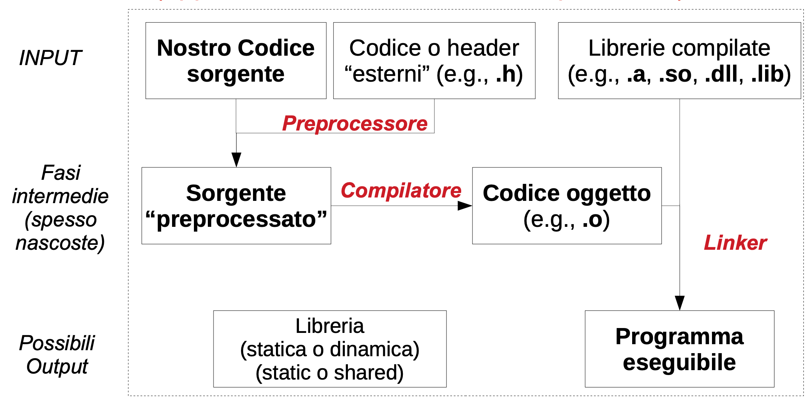
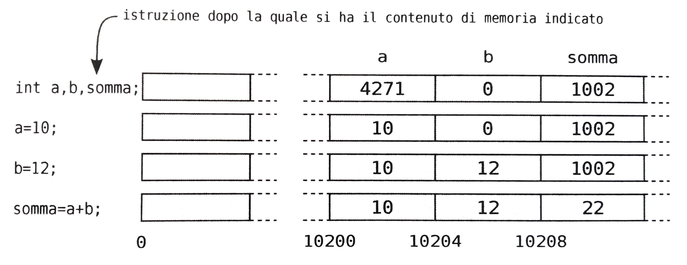

# Il linguaggio C
* È un linguaggio di programmazione general-purpose progettato inizialmente da Dennis Ritchie dei Bell Laboratories e implementato nel 1972. Inventato per sopperire ai limiti del linguaggio B e BCPL
* I linguaggi sono creature vive e vengono migliorati periodicamente:
  * 1973: invenzione del linguaggio C da parte di Rennis Ritchie
  * 1983: National Standard Institute (ANSI) inizia la definizione di ANSI C o C standard
  * 1989: definizione dello standard [C89](https://en.wikipedia.org/wiki/ANSI_C#C89) 
  * 1999: definizione dello standard [C99](https://en.wikipedia.org/wiki/C99) 
  * 2011: definizione dello standard [C11](https://en.wikipedia.org/wiki/C11_(C_standard_revision))
  * 2018: definizione dello standard [C17](https://en.wikipedia.org/wiki/C17_(C_standard_revision))
* La possibilità di utilizzare certe funzionalità del C dipende strettamente dal supporto del compilatore.


# Caratteristiche del C
*E' la lingua franca per gli sviluppatori. Implementazioni di nuovi algoritmi, ad esempio, sono spesso divulgate inizialmente solo in C. E' anche il linguaggio in cui si descrive spesso il comportamento della macchina. Evita superstizione!*

* Linguaggi di programmazione di **alto livello**: gestione intermediata della memoria, oggetti, stream, stringhe, iteratori, ...). Esempi: Python, Javascript, Java, Go, C++
* Linguaggi di programmazione di **basso livello**: gestione della memoria e astrazioni semplici (tipi di dati, funzioni,
strutture dati), parziale visibilità architetturale. Esempi: C, Rust
* Linguaggi di programmazione di **bassissimo livello**: programmi scritti specificamente per un tipo di architettura hardware. Esempi: assembly, VHDL


# Caratteristiche del C
* Il linguaggio è pensato per essere efficiente: lo sviluppatore ha il controllo completo su quello che succede.
* Commettere errori è più facile e subdolo: il linguaggio non permette al compilatore di rilevare gli errori con la completezza con cui lavorano interpreti come Java o Python. Il suo principale inconveniente e' quello infatti di avere un metodo scadente per l'identificazione di errori, che puo' escluderne l'utilizzo ai principianti.
* Gli errori possono produrre conseguenze gravi in termini di sicurezza ed integrità del sistema non esistendo una virtual machine (*concetto di sandbox*).


# Caratteristiche del C
* **Procedurale**: il programma è un insieme di *procedure* (funzioni). Non esiste supporto a strutture modulari più complesse come classi ed oggetti.
* **Compilato**: il codice sorgente deve essere trasformato in linguaggio macchina da un compilatore (e.g., gcc) *prima di essere eseguito*.
* **Tipizzato**: ogni variabile ha un tipo associato, lo sviluppatore deve sempre dichiarare il tipo prima di usare la variabile. E' però possibile utilizzare tipi alternativi per accedere al dato (i.e., lascamente tipizzato).


# Ambito di utilizzo del C

* Sistemi Operativi (e.g., kernel Windows/Linux/Mac/IoS/Android)
* Programmi che interagiscono a basso livello con l’hardware o con il sistema operativo (e.g., device drivers)
* Sistemi embedded (e.g., Arduino)
* Database (e.g., MySQL, MS SQL Server, and PostgreSQL)
* Linguaggi di programmazione (e.g., Python)
* Librerie e routine ad alte performance (e.g., numpy, webassembly)
* Motori grafici 3D (e.g., Unreal Engine C++)
* Software per telecomunicazioni (e.g., openWrt)
* Software di controllo per processi industriali (e.g., PLC)


# Ambienti di sviluppo
*Gli ambienti di sviluppo integrato – o IDE, Integrated Development Environment – sono strumenti fondamentali per il lavoro di un programmatore. Esistono una varietà di ambienti di sviluppo, dai più complessi ed articolati, fino a semplici editor di testo affiancati ad un compilatore.*

* CLion
* Microsoft Visual Studio
* Eclipse
* Visual Studio Code
* Sublime text, vim


# Ambienti di sviluppo (CLion)
* Software a pagamento ma con licenze gratuite per gli studenti (https://www.jetbrains.com/community/education/#students)
* Sviluppato in Java (richiede risorse, portabile)
* Piattaforma moderna, ricca di features, ottimo ambiente di debug
* Prodotto dagli stessi autori di PyCharm (Python) e IntelliJ IDEA (Java/Android)


# Hello World!
L'esecuzione di un programma C inizia sempre dalla prima istruzione della funzione *main*. La funzione *main* accetta argomenti (per ora ignorati) e ritorna un numero intero. Il programma termina quando la funzione *main* termina.

```c
#include <stdio.h>

int main(){
  printf("Hello, World!\n");
  return 0;
}
```


# Hello World! Direttiva include
Linea 1: **#** introduce una direttiva del pre-processore che **include (importa)** un file (**stdio.h**) da un percorso standard (**< >**)

```c
#include <stdio.h>

int main(){
  printf("Hello, World!\n");
  return 0;
}
```


# Hello World! Funzione main()
Linea 3: **int** tipo del valore di ritorno della funzione, **main** nome della funzione, **{** inizio del corpo della funzione. La funzione termina a linea 6 **}**.

```c
#include <stdio.h>

int main(){
  printf("Hello, World!\n");
  return 0;
}
```


# Hello World! Funzione main()
Linea 4: **printf** invocazione della funzione di libreria printf(), che riceve come argomento la stringa costante *Hello, World!* terminata con carattere a capo **\\n**.

Linea 5: **return** istruzione che termina la funzione e ritorna un valore (**0**). Convenzionalmente, ritornare 0 ha il significato di *programma eseguito con successo*.

```c
#include <stdio.h>

int main(){
  printf("Hello, World!\n");
  return 0;
}
```


# Processo di compilazione
* Il compilatore è un programma apposito per convertire linguaggi arbitarti in codice macchina. Esempi di compilatori popolari:
  * GCC (the GNU Compiler Collection)
  * Microsoft Visual C(++)
  * ARM-GCC (ambito architetture proprietarie)
* L’insieme dei programmi utilizzati per gestire tutta la fase di compilazione è detta *toolchain*
* Il linguaggio C, come altri linguaggi (e.g., Java), è uno standard piuttosto che una implementazione specifica. Di conseguenza, possiamo utilizzare il compilatore che preferiamo


# Keywords
* **Codice sorgente**: file di testo che contiene il software scritto dallo sviluppatore
* **File oggetto**: file binario che contiene codice macchina corrispondente al programma C originale più informazioni simboliche
* **File eseguibile**: file binario che contiene il codice macchina pronto per l'esecuzione su una specifica architettura
+ **Linker**: programma per unire più file oggetto con eventuali librerie esterne per ottenere il file eseguibile


# Processo di compilazione


# Compilazione parziale

```shell
$ gcc helloworld.c -o helloworld
$ file helloworld
helloworld: Mach-O 64-bit executable x86_64
```

* Direttiva per eseguire solamente il preprocessore
```shell
$ gcc -E helloworld.c
```

* Direttiva per disabilitare la fase di linking e produrre file oggetto (.o)
```shell
$ gcc -c helloworld.c
$ file helloworld.o
helloworld.o: Mach-O 64-bit object x86_64
```

# Compilazione ed esecuzione
```shell
$ gcc -Wall -o helloworld helloworld.c
$ ./helloworld
```

* Il comando compila il codice sorgente *helloworld.c* in un programma eseguibile di nome *helloworld*
  * -Wall attiva tutti i warnings (Warnings All)
  * -o specifica il nome del file compilato (default=a.out)
* Gli *errori* causano il fallimento della compilazione del programma
* I *warnings*, invece, sono segnalazioni di possibili problemi ma non causano il fallimento della fase di compilazione. In linea generale, è bene risolverli tutti prima di procedere con lo sviluppo.
* E' infine possibile eseguire il programma invocandolo dalla shell utilizzando il nome specificato con l'opzione -o
  

# Messaggi di errore
```c
#include <stdio.h>
#include <stdlib.h>

int main() {
  printf("Hello, World!\n");
  return 0
}
```

```
helloworld.c:6:1: error: expected ';' after return statement
helloworld.c:2:1: warning: Unused "#include <stdlib.h>"
```

# Commenti

* I commenti sono porzioni di testo che non vengono considerate dal compilatore (i.e., vengono eliminati dal preprocessore)
* I commenti sono fondamentali per rendere leggibile il codice e promuovere la collaborazione fra più individui

```c
/*
 * Questo è un commento multi-linea
 */

/* Questo è un commento multi-linea */

// Questo è un commento singola-linea
// Si tratta di una forma ereditata dal C++ 
// Non molto apprezzata dai puristi C
```

# Parole chiave
| **Parole chiave** | **Utilizzo** |
| ----------------- | ------------ |
| break case continue default do else for goto if return switch while | costrutti di controllo |
| char double enum float int long short signed struct union unsigned void | tipi di dato semplice |
| auto const extern register static volatile | modificatori di volatività e persistenza |
| sizeof | operatore che ritorna la dimensione di una varibile |
| typedef | definizione di tipi definiti dall'utente |


# Identificatori
* In C un identificatore è un nome che si riferisce a funzioni, variabili, ed oggetti in genere definiti nel codice
* Non può cominciare con un numero ma può contenere qualsiasi combinazione di:
  * lettere maiuscole e minuscole
  * numeri
  * il carattere underscore (_)
* Non può essere una parola chive del linguaggio
* Esempi **validi**: Prova_1, prova_1, media_pasata, _tot
* Esempi **invalidi**: 1_prova, totale_%, somma_{


# Variabili
* Una variabile è una porzione di memoria che contiene dei dati che possono essere modificati durante l'esecuzione. Ogni variabile deve essere dichiarata, ovvero associata ad un identificatore ed a un tipo.

```c
#include <stdio.h>

int main() {
    int a, b, somma;
    
    a = 10;
    b = 12;
    somma = a + b;
    printf("somma=%d\n", somma);
    return 0;
}
```

# Variabili



# Variabili in sola lettura
* E' possibile dichiarare variabili *read-only* utilizzando la parola *const*
* Il valore di una variabili in sola lettura, una volta inizializzato, non può essere modificato
* Si tratta di una limitazione per il programmatore ma consente al compilatore di svolgere ottimizzazioni
* Molto utile il progetti complessi

```c
int main() {
    const double pi = 3.1415926536;
    const double e = 2.7182818284;
}
```

# Espressioni
* *Un programma C e' una sequenza di espressioni. Le espressioni sono combinazioni di variabili, costanti, chiamate a funzione per mezzo di opportuni operatori*
* Non esiste in C una reale delimitazione fra espressioni logiche ed aritmetiche in quanto lo *0* aritmetico è considerato equivalente al valore logico *falso*

```c
45 * (a + b)
delta * sqrt(abs(x1 * x2))
sqrt(a * b - c) <= 10
(c1 || c2) && c3
max = a > b ? a : b
a % b
```

# makefile
* Per gestire la compilazione di un progetto C complesso si fa uso di tool ausiliari (e.g., make).
* Il comando make cerca all'intero della directory corrente un file di nome *makefile* o *Makefile*.
* make evita di eseguire operazioni inutili: il codice viene compilato solo se vengono rilevate modifiche ai sorgenti.

```make
helloworld: helloworld.c
    gcc -Wall -o helloworld helloworld.c
```

# makefile
* make supporta l'utilizzo di variabili e simboli speciali.
* $(CC) : variabile che contiene il comando di compilazione (default: cc)
* $(CFLAGS): variabile che contiene le opzioni di invocazione del compilatore
* $@ : metacarattere che viene sostituito con il target (helloworld)
* $^ : metacarattere che viene sostituito con le dipendenze (helloworld.c)
```make
CC=gcc
CFLAGS=-Wall

helloworld: helloworld.c
    $(CC) $(CFLAGS) -o $@ $^
```

# makefile
* Di solito si imposta un target speciale *clean* per pulire il sistema dai residui della compilazione

```make
CC=gcc
CFLAGS=-Wall -g

clean:
    rm -rf helloworld

helloworld: helloworld.c
    $(CC) $(CFALGS) -o $@ $^
```

# CMake
* CLion utilizza un sistema chiamato CMake (https://cmake.org/)
* Il file che gestisce i processi di compilazione è CmakeLists.txt
* Si tratta di un sistema per generare il Makefile molto utile per aumentare la portabilità e la robustezza del processo di compilazione
* Anche se possibile, *nel corso non utilizzeremo CMake in modo esplicito, ma lo utilizzeremo attraverso la GUI di CLion*

# CMakeLists.txt
```cmake
cmake_minimum_required(VERSION 3.15)
project(hello C)
set(CMAKE_C_FLAGS "-Wall -Wconversion -Wformat")
set(CMAKE_C_STANDARD 99)

add_executable(hello main.c)
target_link_libraries(hello m)
```
**project(hello C)**: nome del progetto, linguaggio

**set(CMAKE_C_FLAGS "-Wall -Wconversion -Wformat")**: opzioni di compilazione

**set(CMAKE_C_STANDARD 99)**: standard C99

**target_link_libraries(hello m)**: configura il linker per collegare libreria matematica (m)
