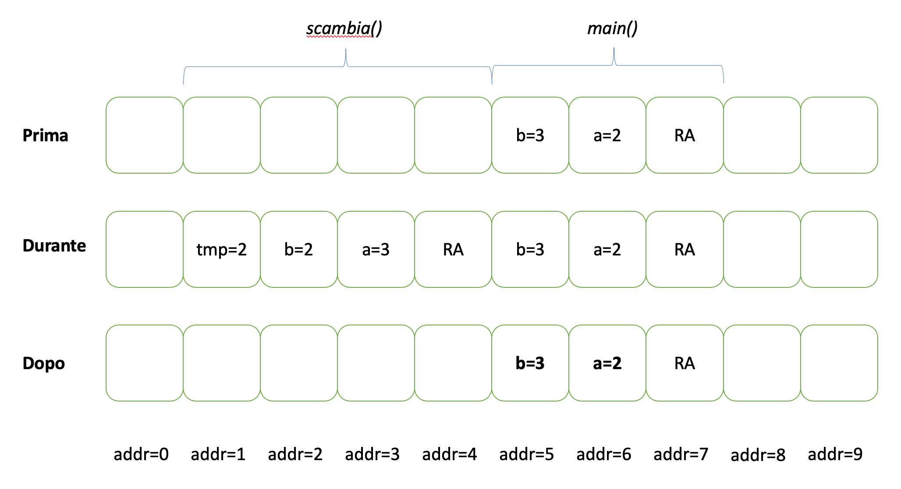
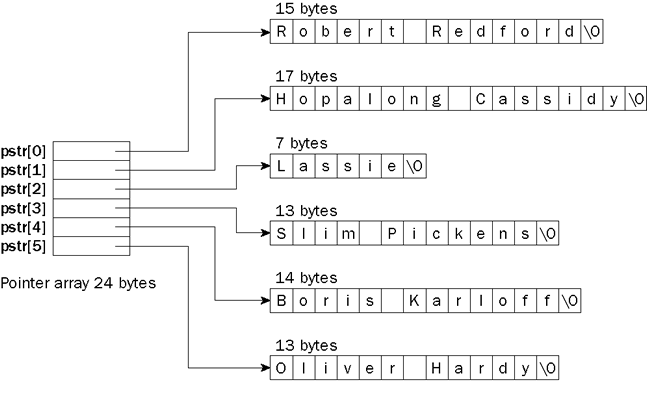

# Le funzioni
* Un funzione è una sequenza di istruzioni che vengono attivate a seguito di una apposita chiamata
* Vantaggi: 
  * favoriscono modularizzazione del codice
  * favoriscono il riuso del codice (librerie) 
  * favoriscono lo sviluppo incrementale (creazione di interfacce che disaccoppiano parti di software)
  * favoriscono la leggibilità del codice
    
* Svantaggi:
  * Determinazione dell’indirizzo di rientro al codice chiamante 
  * Scambio di informazioni fra funzioni e codice chiamante (passaggio di parametri)

# Dichiarazione di funzioni
* Serve per segnalare al compilatore l'esistenza di una determinata funzione (e come invocarla) ma non specifica le istruzioni che compongono la funzione
* La *dichiarazione* di una funzione deve sempre precedere nel sorgente la prima invocazione della stessa. La *definizione*, invece, può essere presente in un qualunque punto del sorgente o in una libreria esterna
* La dichiarazione specifica il *prototipo* della funzione:
  * il tipo ritornato
  * il nome della funzione
  * l'elenco dei parametri (argomenti)
* In fase di dichiarazione è consentito omettere il nome dei parametri

```c
int secondi(int h, int m, int s);
/* oppure */
int secondi(int, int, int);
```

# Definizione di funzioni
Una definizione è costituita da due parti:
  
* la *dichiarazione della funzione*
* il *corpo della funzione*, racchiuso tra parentesi graffe e comprendente zero o più di queste componenti:
  * dichiarazioni e definizioni di variabili
  * istruzioni
  * istruzione return

```c
/* esempio di definizione */
int secondi(int h, int m, int s) {
    return (3600 * h + 60 * m + s);
}
```

# Invocazione di funzioni
* L'*invocazione* di una funzione è l'operazione con la quale si richiama l'esecuzione della funzione
* Per richiamare una funzione si deve utilizzare il nome della funzione seguita dagli argomenti racchiusi da parentesi tonde e separati da virgole
* Un'invocazione di funzione trasferisce il controllo alla prima istruzione della funzione stessa
* Una funzione termina quando: (a) viene eseguita l'istruzione *return*, oppure (b) viene eseguita l'ultima istruzione

```c
int secondi(int h, int m, int s) {
    return (3600 * h + 60 * m + s);
}

int main() {
    int h=1, m=1, s=1, totale_secondi;
    totale_secondi = secondi(h,m,s);
    printf("Totale secondi: %d\n", totale_secondi);
}
```

# Tipo void
* L’uso del tipo *void* nelle funzioni identifica *tipi nulli*
* Se usato come tipo di ritorno, la funziona non restituisce alcun valore
* Se usato come parametro di input, la funzione non accetta nessun parametro

```c
void say_hi(void) {
    printf("Hi!\n");
}

int main() {
    say_hi():
    return 0;
}
```

# Parametri di input
* È obbligatorio indicare il tipo delle variabili. Se non ci sono variabili, si usa il tipo *void*
* Non è possibile indicare parametri facoltativi
* È possibile indicare funzioni con numero di parametri variabile, (vedi *printf*)
* Il passaggio dei parametri avviene *sempre per copia (copia del valore)*

```c
void try_modification(int value) {
    // solo la copia ricevuta dalla funzione viene modificata
    value = 0;
}

int main(){
    int a = 5;
    try_modification(a);
    printf("a = %d\n", a); /* a = 5 */
    return 0;
}
```

# Visibilità e tempo di vita delle variabili locali
* Le variabili che abbiamo utilizzato fin’ora sono *variabili locali*, visibili solo all’interno della funzione
* Le funzioni invocate *non hanno accesso* alle variabili di livello superiore!
* La gestione della memoria delle variabili locali è *automatica*
  * Le variabili vengono allocate al momento dell’invocazione della funzione
  * Le variabili vengono de-allocate al momento del ritorno della funzione
* Ad ogni invocazione, le variabili della funzione non dipendono dalle esecuzioni precedenti!


# Variabili globali

* Il C supporta anche *variabili globali*, visibili sempre e da tutte le funzioni
* *Preferibile limitare utilizzo di variabili globali, oppure utilizzarle come costanti*

```c
#include<stdio.h>

int a;
/* const int a; -> errore! */

void try_modification(void){
    a = 10;
}

int main(){
    a = 5;
    try_modification(); /* a = 10 */
    printf("a=%d\n", a);
}
```

# Variabili locali static
* Una variabile locale è detta *static* se il suo tempo di vita corrisponde a quelllo del processo
* E' possibile utilizzare variabili static per avere funzioni che mantengono uno stato fra diverse invocazioni

```c
void counter() {
    static int count=0;
    
    count++;
    printf("count=%d\n", count);
}

int main(){
    counter(); /* count=1 */
    counter(); /* count=2 */
    
    return 0;
}
```

# Passaggio per valore (copia del valore)
* Secondo la modalità del passaggio per valore *ogni funzione ha una propria zona di memoria per memorizzare i dati* (messa a disposizione solo al momento dell’effettivo utilizzo e rilasciata quando non è più necessaria)
* Al momento dell’uso della funzione *i parametri sono copiati*, quindi non vi è un accesso diretto ai valori del codice chiamante

```c
void scambia(int a, int b) {
    int tmp = a;
    a = b;
    b = tmp;
}

int main() {
    int a = 2, b = 3;
    scambia(b, a);
    printf("a=%d b=%d\n", a, b);
}
```

# Passaggio per valore (copia del valore)



# Passaggio per riferimento (copia del riferimento)
* Permette alla funzione chiamata di modificare il valore della variabile passata dal chiamante
* Evita la copia di variabili voluminose
* Contente alla funzione chiamata di ritornare più di un valore di ritorno
* Il passaggio per riferimento *implica il passaggio per valore di un puntatore alla variabile*

```c
void scambia(int *a, int *b) {
    int tmp = *a;
    *a = *b;
    *b = tmp;
}

int main() {
    int a = 2, b = 3;
    scambia(&b, &a);
    printf("a=%d b=%d\n", a, b);
}
```

# Passaggio per riferimento (copia del riferimento)


# Passaggio di puntatori const
* Talvolta è necessario passare alla funzione variabili di grandi dimensioni (array, matrici)
* Per evitare la copia della variabile si usa un puntatore alla variabile. Tuttavia, questa possibilità si scontra con il fatto che, tramite il puntatore, la funzione può modificare i dati del chiamante
* Questo può determinare che un errore di implementazione nella funzione propaghi esiti non voluti. Il problema è risolvibile attraverso *puntatori definiti costanti*

```c
void scambia(const int *a, const int *b) {
    int tmp = *a;
    *a = *b;        /* errore di compilazione */
    *b = tmp;       /* errore di compilazione */
}

int main() {
    int a = 2, b = 3;
    scambia(&b, &a);
    printf("a=%d b=%d\n", a, b);
}
```

# Vettori di puntatori (a carattere)
* Gli elementi di un vettore possono essere di qualunque tipo:
  * numeri interi, virgola mobile, caratteri, ma anche *puntatori*
  * ad esempio char *\*settimana[]* è un vettore che memorizza 7 puntatori a carattere
  * tipo in genere utilizzato per gestire gruppi di stringhe di caratteri

```c
char *settimana[] = {
    "lunedì", 
    "martedì", 
    "mercoledì",
    "giovedì", 
    "venerdì",
    "sabato", 
    "domenica" 
};

printf("%s\n", settimana[0]); /* Output: lunedi */
```

# Vettori di puntatori (a carattere)


# Passaggio di parametri al programma principale
* E' possibile passare parametri *dalla shell* ad *un programma C* utilizzando parametri opzionali della funzione main()
* **argc** è un numero intero e rappresenta il numero dei parametri ricevuti (considerando anche il comando stesso)
* **argv** è un vettore di stringhe che rappresenta i parametri stessi (argv[0] è il comando stesso)

```c
int main(void) {
    
}
```

```c
int main(int argc, char *argv[]) {
    
}
```

# Passaggio di parametri al programma principale
```c
int main(int argc, char *argv[]) {
    int i;
    
    for (i=0; i<argc; i++) {
        printf("[%d] %s\n", i, argv[i]);
    }
}
```

```shell
$ ./a.out -a -b -c
[0] ./a.out
[1] -a
[2] -b
[3] -c
```

# Passaggio di parametri al programma principale
```c
int main(int argc, char *argv[]) {
    int a;
    double b;
    char c[128];

    if (argc != 4) {
        printf("usage: %s int double char[]\n", argv[0]);
        exit(1);
    }
    
    a = atoi(argv[1]);
    b = atof(argv[2]);
    strncpy(c, argv[3], sizeof(c));
    /* secure code, guarantees that the string is null-terminated */
    c[sizeof(c) - 1] = '\0';
    printf("%d %f %s\n", a, b, c);
}
```


# Ricorsione
* Una funzione è definita in modo ricorsivo se è definita in termini di se stessa.
* Nella definizione ricorsiva di una funzione è possibile identificare *casi base* e *casi ricorsivi*:
* I *casi base* permettono di calcolare il valore della funzione, anche se solo nei casi più semplici
* I *casi ricorsivi* permettono di calcolare la funzione mediante altre valutazioni della funzione

```c
n! = 1 x 2 x ... x (n-2) x (n-1) x n

n! = 1            (if n == 0) // caso base
n! = n x (n-1)!   (if n > 0)  // caso ricorsivo
```

# Ricorsione (fattoriale)
```c
// implementazione fattoriale iterativa
int fatt(int n) {
    int fatt, i;
    for (i=1, fatt=1; i<=n; i++)
        fatt = fatt * i;
    return fatt;
}
```

```c
// implementazione fattoriale ricorsiva
int fatt_r(int n) {
    if (n == 0)
        return 1;
    return n * fatt_r(n - 1);
}
```

# Ricorsione (fibonacci)
```c
// implementazione fibonacci iterativa
int fibonacci(int n) {      
    int x = 0, y = 1, z = 0;
    for (int i = 0; i < n; i++) {
        z = x + y;
        x = y;
        y = z;
    }
    return z;
}
```

```c
// implementazione fibonacci ricorsiva
int fibbonacci_r(int n) {    
    if (n == 0) return 0;
    if (n == 1) return 1;
    return (fibbonacci(n-1) + fibbonacci(n-2));
}
```